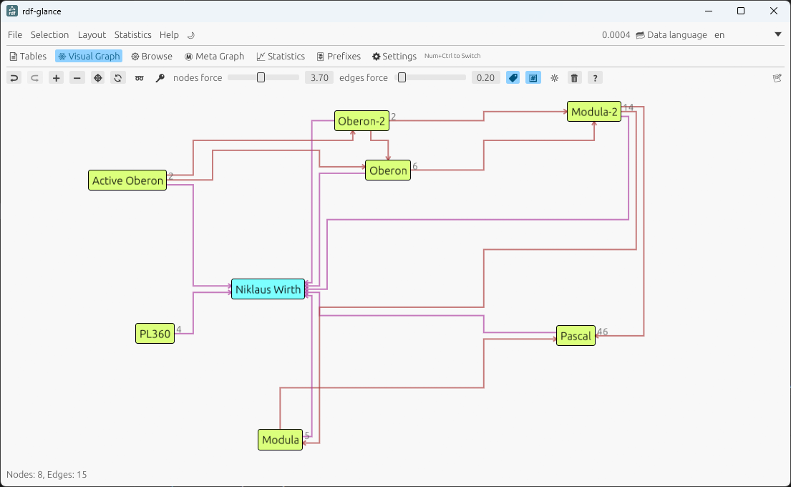

# RDFGlance

**RDFGlance** is an open-source application designed to provide a visual representation of RDF (Resource Description Framework) data. The application is programmed using `Rust`, ensuring high performance and safety.

- See the structure of your RDF data — even millions of triples — at one glance
- Explore RDF Data, use advanced graph algorithm and visualization in seconds without coding.
- Easy to install (Small Desktop App - self-contained executable is only 17 MB)
- Optionally [Serverless WASM Based Web Application](https://xdobry.github.io/rdfglance/) (limited functionality)
- Zero runtime needed
- No HTML, No Server, 100% React free
- No tracking, No account needed, real open source
- Engineered for real users by a real programmer, written in Rust for direct, uncompromised performance on the metal.
- Multithread Processing to use 100% of your CPU power

Try [Rdfglance WASM version](https://xdobry.github.io/rdfglance/) directly in your browser.
You can browse your RDF Data online.
The WASM version does not offer all functionality. Especially no multithread non-blocking processing.

You may pass query parameter with url of ttl data to be loaded.
https://xdobry.github.io/rdfglance/?url=https://purl.humanatlas.io/asct-b/kidney

The server with ttl data should allow cors by setting the http header "access-control-allow-origin: *" in the response.

## Description

**RDFGlance** allows users to easily visualize and interact with `RDF` data. 
It is `RDF` Visualization tool.
It provides a user-friendly interface to explore the relationships and properties within `RDF` datasets in different ways: as visual interactive graph, table or data sheet.
The application is suitable for developers, researchers, publisher and anyone interested in working with semantic web technologies.

My primary goal was to ensure the program runs as fast as possible and maintains high performance even when handling large datasets.
Therefore, the program has been optimized to efficiently process and manage large number of triples and records.


Individually styled visualization of nodes and edges


Orthogonal edge routing



[Manual](documentation/manual.md)

## Features

RDFGlance offers the following visualization capabilities for RDF data:

- Visual interactive graph
- data tables organized by instance types.
- You can navigate the nodes like in browser from node to node.
- Display of statistical information about types, data properties, and references, sorted by type
- Can safe all data, graph and styles as project in own binary format for fast loading.
- Compute some graph statistics and adapt node size of their result. Following graph statistics are implemented:
  - betweenness centrality
  - closeness centrality
  - degree centrality
  - page rank
  - k-core centrality
  - eigenvector centrality
  - louvain clustering (community detection) - used to color nodes
  - spectral clustering
- Layout Graphs Types
  - force directed default
  - circular
  - hierarchical
  - spectral
  - orthogonal edge routing
- CSV Export for table views
- Semantic zoom based on graph statistics
- Can open ttl file passed as start parameter
- Can open ttl file dropped from explorer
- Support for display of multilingual data

The RDF Data can be loaded by using following formats:

- ttl
- rdf/xml
- trig - named graphs are ignored
- nt (n-tuples)
- nq (n-quads) - named graphs are ignored

Defined prefixes are taken from the input file if possible.

The program assumes that the RDF nodes (triples) are organized using RDFS (RDF Schema).
So every node have a assigned rdf type. The program index and show all data using these types.

Some features of RDF are not supported very well. This includes:

- named graphs
- RDF list (you may resolve the lists to simple predicates. The order are preserved)

I hope to improve it in later versions.
You may use github issue system to report bug and feature wishes.

## Installation

The application is only one executable file without dependencies that can be just copied somewhere.
So no installation package need to be provided.
As windows user you can just use executable from releases directory:
[github releases](https://github.com/xdobry/rdfglance/releases)

You may also associate the TTL file extension with the program.
So you can open rdf-glance just by double-click on the file in the file explorer.

## Compilation

To compile **RDFGlance**, you need to have [Rust installed](https://www.rust-lang.org/tools/install) on your system.
Follow these steps to compile the application:

1. Clone the repository:
  ```sh
  git clone https://github.com/xdobry/rdfglance.git
  cd rdfglance
  ```

2. Build the application using Cargo:
  ```sh
  cargo build --release
  ```

3. The compiled binary will be located in the `target/release` directory.

You may also pick the precompiled executable for windows from [github releases](https://github.com/xdobry/rdfglance/releases).

## Usage

After compiling the application, you can run it using the following command:
```sh
./target/release/rdf-glance
```

For more information on how to use **RDFGlance**, refer to the documentation provided in the [repository](documentation/manual.md).

## Wasm Web Application Build

You can run the application in browser using the WASM (Web Assembly) technology.
The rust code is compiled to wasm that can be run in browser in almost native code speed.
The HTML engine is not used and the application render the UI using WebGL.

Prepare wasm compilation

  ```sh
  rustup target add wasm32-unknown-unknown
  cargo install trunk
  ```

  ```sh
  cargo build --target wasm32-unknown-unknown
  ```

Run server in dev mode

  ```sh
  trunk serve
  ```

You can run the application in your browser using local address : http://localhost:8080

Build static web content. Output in dist folder

  ```sh
  trunk build
  ```

Build for github pages

  ```sh
  trunk build --release --public-url /rdfglance/
  ```


The last web release is available here [Rdfglance WASM version](https://xdobry.github.io/rdfglance/)

You need to configure vs code to switch to wasm mode by Ctrl-Shift-P + Preferences Open User Settings (JSON). Add option

     "rust-analyzer.cargo.target": "wasm32-unknown-unknown",


## Known Problems

- Some RDF files can not be read. You will see the error messages in the std output. It seems that the used oxrdf parser is quite sensitive.
- For WASM (Web) the loading big rdf files the gui may freeze for a while. Multithread processing is not support for WASM
- There is configurable limit of visual nodes in visual graph set to 40.000. It depends on your computer and data how hight the limit can be set for acceptable performance.
- If your computer has no GPU support the application can be quite slow, especially in browser.

I hope that the application can be useful for others. 
Please report your feature request as [github issue](https://github.com/xdobry/rdfglance/issues).

## Technology

**RDFGlance** leverages the `egui` library, a simple and fast GUI library for Rust that can create both desktop and web applications using WebAssembly (Wasm).
Unlike traditional web applications that rely on HTML and React, `egui` allows for a more lightweight and efficient approach. This results in a smaller application size and improved performance, enabling **RDFGlance** to handle and display larger RDF datasets, up to 100,000 triples, without any delays.

**RDFGlance** uses some `oxigraph` rust libraries. 

I have developed the application because my frustration about low performance of existing rdf solutions and I wanted to learn and test Rust and `egui` framework.
It is a learning and hobby project.

## Releases

You can use ready to use binaries for windows see [github releases](https://github.com/xdobry/rdfglance/releases) 

## Contributing

I welcome contributions from the community.
If you find something odd, please open an issue — even small notes help.
Please report bugs only this way they can be fixed.
You can also create [github issue](https://github.com/xdobry/rdfglance/issues) or just drop me an email <mail@xdobry.de>.

I've been developing open-source software for many years, but lately I hardly get any feedback, even though it's being used.

## License

**RDFGlance** is licensed under the GPL License. See the `LICENSE` file for more details.