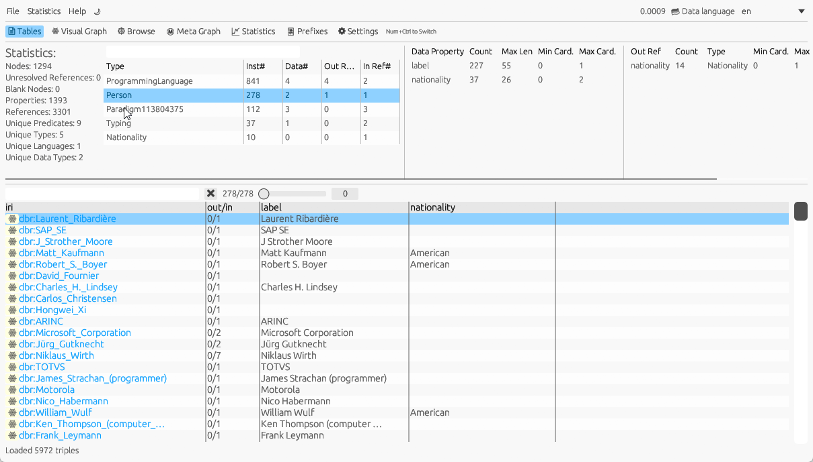
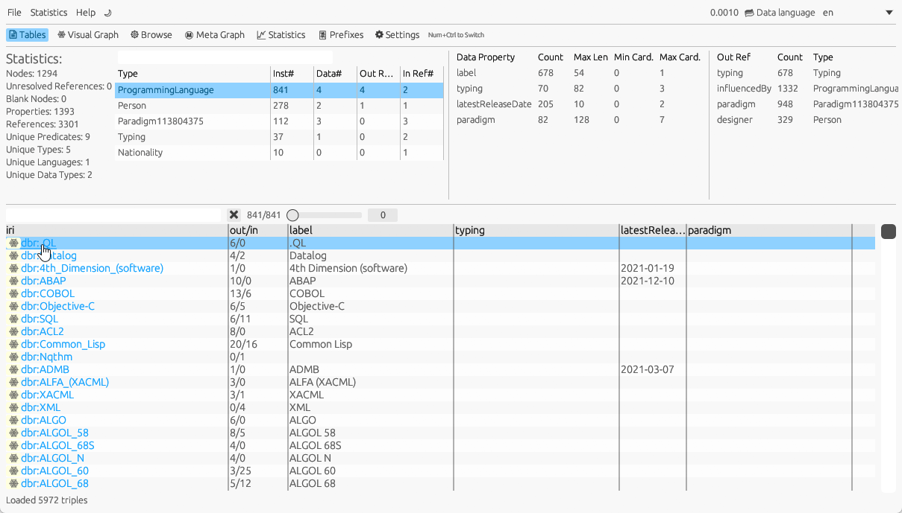
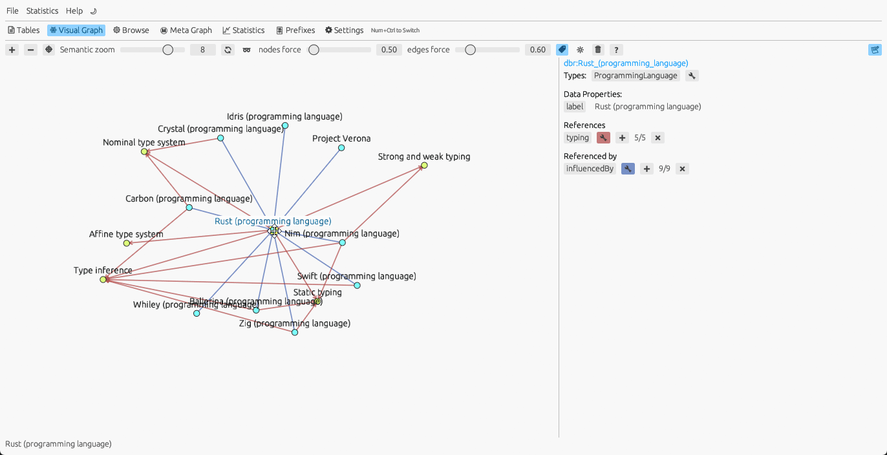
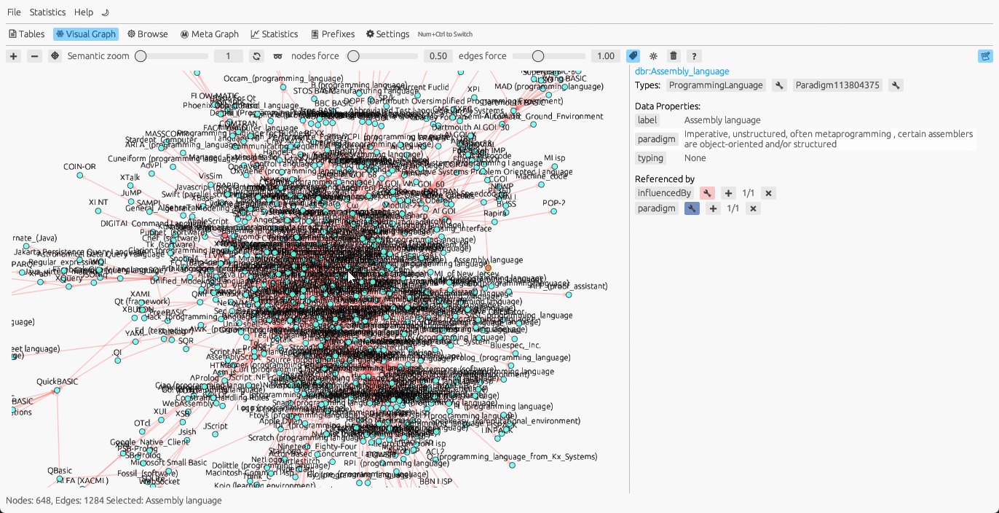
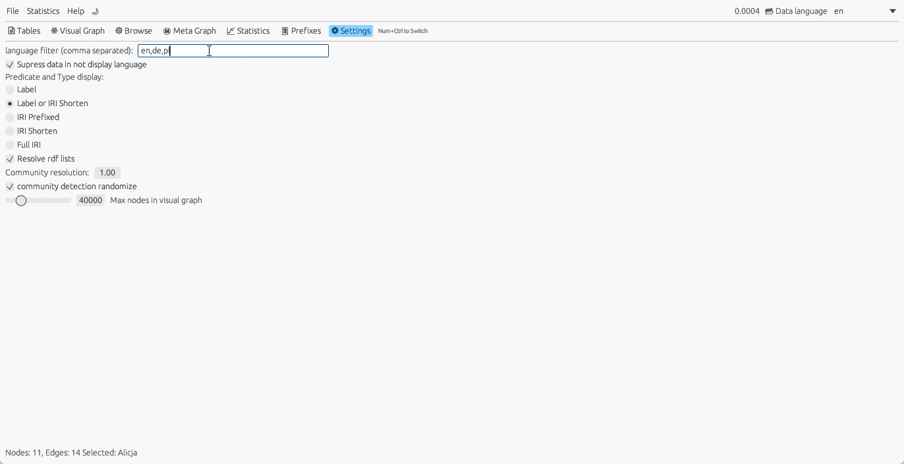

# General Information

This guide is a brief tutorial, not a full reference, and highlights only the less obvious features of the application.

First, you should load some RDF data.
The application supports TTL (Turtle) and RDF/XML formats.
Sample RDF data is available in the [sample-rdf-data](../sample-rdf-data/programming_languages.ttl) directory.

You can load your **RDF** file by:
- Using the menu **File → Import RDF File**
- Dragging the file onto the application window
- Providing the file location as an application start parameter. This works best if you associate the `.ttl` file extension with **RDFGlance**, so you can open a `.ttl` file from your file explorer with a double-click.

After loading data, you can choose among the following tabs: **Tables**, **Visual Graph**, **Browse**, **Meta Graph** and **Statistics**
A good place to start is the **Tables** tab.

# Tables Tab

**RDFGlance** sort all nodes by types.
First you can see some statistics of RDF data.

Then you can see the list of all types with some statistic
- count of all instances of this type
- count of unique data properties of all instances of this type
- count of unique object properties of all instances of this type
- count of unique referenced object properties of all instances of this type

Remember that in RDF Schema an instance can have multiple types. 

After selecting the type you can see all instances as a table.
You can sort the instances by some data property.
The `out/in` column showns the count of outgoing and ingoing edges (object properties).
By clicking of the `out/in` cell you can browser all references in pop-up windows.

You can click on the cell to see the whole value of the data property or other values of the same predicate.
Remember in rdf one node can have multiple objects of same predicate.

# Browser Tab 

In the browser you can see all properties of one node.

Following information are show:

- type of the node (as label). You can click the type to change to table view and see all instances of clicked type
- all data properties
- all object properties (references)
- all objects that reference this node (referenced by)

# Visual Graph

The **visual graph** displays nodes and edges (relationships) as an interactive graph.
It is designed to let you manipulate relationships (hide, unhide, or expand) to explore connections within the data.

You can interact with the graph by clicking on nodes.
A double-click will expand all outgoing or incoming relationships of the selected node.

On the right-hand side, you can view all data properties and relationships of the selected node.
You can also use the relation buttons to expand a chosen relationship.
Additionally, you can hide or unhide specific relationship types or expand a relationship type for all visible nodes.

## Node and Edge Styling

You can adapt many styling parameters as color, size, label and symbol for node and object property
in dependency of type or predicate.

## Safe Project

You can save the application state in its own binary format.
This preserves your node and edge styling, as well as the current state of the visual graph.

The data are stored in a compressed binary format optimized for the application.
Loading data in this format is faster, and the application requires less internal memory when reloading it.

This functionality is available **only in the desktop version** of the application.

# Meta Graph

The **meta graph** shows types as nodes and the relationships between them.
It corresponds to a class diagram in traditional programming data modeling.
The meta graph does not use OWL or RDFS definitions; instead, it is derived solely from an analysis of the data.

The size of each node indicates the number of instances.

# Statistics

The application implements several well-known graph algorithms.
These algorithms operate only on the data present in the **visual graph**.
Therefore, you must choose which nodes to analyze by adding them to the visual graph.

There are currently two types of graph algorithms:

- **Node scoring algorithms** – These assign a numerical value to each node based on topological information.
  The value, scaled between 0 and 1.0, is automatically used to determine the node size:
  - Betweenness centrality
  - loseness centrality
  - Degree centrality
  - PageRank
  - K-core centrality
  - Eigenvector centrality
- **Clustering algorithms** – These group nodes into clusters based on topological information.
The resulting groups are used to color the nodes:
  - Louvain clustering (community detection) – used to color nodes

These algorithms are widely documented on the web, so detailed explanations are not included here.
To apply an algorithm, choose it from the **Statistics** menu.
The results will then be available as tables in the **Statistics** tab.

# Importing RDF Data from URL

RDF is a standard for publishing complex data in scientific and government domains.
You can download RDF data directly from a URL.
The application will send a content token to request TTL data from the server.
This works for both the desktop and web variants.

The web variant is limited by the browser’s CORS policy (Cross-Origin Resource Sharing).
Therefore, the RDF publishing server must allow cross-origin access to the resource (RDF data) by setting the appropriate HTTP headers.
Otherwise, you will need to download the data to your local file system and import it from disk.
Alternatively, RDF data publishers can host the **RDFGlance** WebAssembly application on their own server.

For the web version, you can also launch the application with an additional URL query parameter:

https://xdobry.github.io/rdfglance/?url=https://purl.humanatlas.io/asct-b/kidney

Simply add the query parameter `?url={your rdf data url}` to load the data automatically at the start of the web application.

# Multilingual RDF Support

RDF has built-in support for multilingual data by using string literals with defined language tags.
**RDFGlance** supports viewing such data.

First, you can define a filter to import only literals in a chosen list of languages.
You can set this filter in the settings.
For example, entering `en,de,pl` will import only literals with the language tags **en**, **de**, or **pl**.
Make sure to use the same language abbreviations as those used in the raw RDF data.
Literals without a defined language tag are always imported.

After loading, you can choose the display language.
The application will show all data in this language and will fall back to language-less literals
or to **en** literals if no literals in the selected display language are available.

# Keyboard accessibility

It is possible to navigate the data only by using keyboard.
First the note tab can be switch by pressing Ctrl+Num.

- Ctrl-0 - Table Tab
- Ctrl-1 - Visual Graph
- Ctrl-2 - Browse
- Ctrl-3 - Meta Graph
- Ctrl-4 - Statistics
- Ctrl-5 - Prefixes
- Ctrl-6 - Settings

Global Shortcuts
- Ctrl-O - Import new RDF File
- Ctrl-S - Save Project

If there are not data Arrow can be used to select last visited rdf file and press enter to load it.
Delete Key will delete the selected last visited file entry.

## Shortcuts for Table Tab

- Arrow Up,Down, Page UpDown, Home, End - Navigate in Table
- Arrow Left/Right move the data column view
- Ctrl Arrow Up+Down - Change Selected Type
- Ctrl-F - filter node by properties value (focus filter text field)
- Enter - Browser Selected Instance
- G - Show selected instance in visual graph
- R - Show references for selected instance
- 1..9 - sort the data on n-th column ascendent

In context of reference window
- Enter - Browse reference
- F - filter all references of predicate and selected instance

## Shortcuts for Visual Graph

global
- Key + - Expand All Nodes
- Key - - Remove All leaves Nodes
- F5 - refresh layout
- Home - center view (reset zoom and translation)

In context of selected node
- E - Expand selected node
- H - Hide selected node
- O - Hide other nodes than selected
- T - Hide all nodes of the type of selected node

## Shortcuts for Node Browser

- Alt Arrow Right, Alt Arrow Right - navigate in browser history
- Arrow Up/Down Arrow Right/Left - Change selected reference
- Enter - Browse selected reference
- F - Show all instances of this type filtered by predicate and current instance

## Shortcuts for Statistics Tab

- Arrow Up,Down, Page UpDown, Home, End - Navigate in Table
- Enter - Browser Selected Instance
- G - Show selected instance in visual graph
- 1..9 - sort the n-th result column descendant
