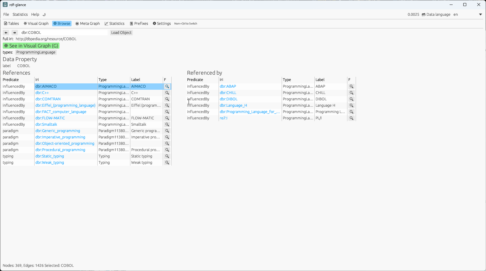

# General Information

At this time the application may not be self-explained. So here some screenshot with additional information.

First you should load some rdf data. The application supports ttl (turtle) and rdf/xml formats.
There is some sample rdf data in the [sample-rdf-data](../sample-rdf-data/programming_languages.ttl) directory.

You can load your rdf-file by:
- using menu File/Import RDF File
- drag file on the application
- use file location as application start parameter. This work good if you associate the file extension with rdf-glance. So you can open ttl-file from file explorer with one double-click on it.

After it you may chose possible tabs: Tables, Visual Graph, Browse, Meta Graph and Statistics
The good point is to start is "Tables" tab.

# Tables Tab

RDFGlance sort all nodes by types.
First you can see some statistics of RDF Date.

Then you can see the list of all types with some statistic
- count of all instances of this type
- count of unique data properties of all instances of this type
- count of unique object properties of all instances of this type
- count of unique referenced object properties of all instances of this type

Remember that in RDF Schema an instance can have multiple types. 

After selecting the type you can see all instances as a table.
You can sort the instances by some data property.
The out/in columns shown the count of outgoing and ingoing edges (object properties).
By clicking of the out/in cell you can browser all references in pop-up windows.

You can click on the cell to see the whole value of the data property or other values of the same predicate.
Remember in rdf one node can have multiple objects of same predicate. 

# Browser Tab 

In the browser you can see all properties of one node.

Following information are show:

- type of the node (as label). You can click the type to change to table view and see all instances of clicked type
- all data properties
- all object properties (references)
- all objects that reference this node (referenced by)

# Visual Graph

Visual graph shows nodes and edges (relations) as visual graph.
It is intended to manipulate the relations (hide, unhide, expand) to discover relations
in the data.

You can manipulate the graph by clicking the nodes.
Double click will expand all outgoing or incoming relation of the node.

On the right side you can see all data properties and relation of the node.
You can also use the relation buttons to expand chosen relation.
You may hide or unhide some relation type or expand some relation type for all visible nodes.

# Meta Graph

The meta graph show types as nodes and relation between them.
It correspond to class diagram traditional programming data modelling.
The meta graph does not use the owl or rdfs definitions but only is driven be analyze of the data.
The size of nodes indicates the number of instances.

# Statistics

The application implement several well known graph algorithms.
The algorithms work only on the data in visual graph.
This way you need to chose which nodes should be analyzed by adding them to visual graph.

There are currently 2 types of graph algorithms. 
The first type assign to every node a number that is driven from topological information.
This number that is scaled to value between 0 and 1.0 is automatically used as node size.

  - betweenness centrality
  - closeness centrality
  - degree centrality
  - page rank
  - k-core centrality
  - eigenvector centrality

There is also another type of algorithm that group nodes in cluster based on topological information.
The groups are then used to color the nodes.

  - louvain clustering (community detection) - used to color nodes

The algorithms are well described in the web so I will not do it here.
The algorithms are applied by choosing the menu item form statistics menu.
After that the result as table are available on statistics tab.

# Importing RDF Data from URL

RDF is standard for publishing complex data in science and government area.
You can download the RDF data directly from URL.
The application will send content token to ask the server for TTL data.
This work for both desktop and web variant.
The web variant is limited by CORS policy (Cross-Origin Resource Sharing) of the browser.
So the rdf publishing server must allow the cross access of resource (rdf data) but setting special http header.
Otherwise you need to download to data to local file system and import it from the disk.
An option for rdf data publisher will be to host the rdfglance wasm on own server.

For Web you can even lunch the application with additional url query parameter.

https://xdobry.github.io/rdfglance/?url=https://purl.humanatlas.io/asct-b/kidney

So please add query parameter ?url={your rdf data url}

And this will load the data direct at the start of web application.

# Multilingual RDF Support

RDF has build-in support for multilingual data by using string literals with defined language tag.
Rdfglance support viewing of such data.
First you may define the filter to import only literal in chosen language list.
You may set in in settings.
For example "en,de,pl" will accept only literals in language en,de and pl.
You need to use the same language abbreviation as in raw RDF data.
The literals without defined language are always imported.

After the loading can chose the display language.
The application will display all data in this language and fallback to language-less literals 
or "en"-literals if no literals in display language are found.

# Keyboard accessibility

It is possible to navigate the data only by using keyboard.
First the note tab can be switch by pressing Ctrl+Num.

- Ctrl-0 - Table Tab
- Ctrl-1 - Visual Graph
- Ctrl-2 - Browse
- Ctrl-3 - Meta Graph
- Ctrl-4 - Statistics
- Ctrl-5 - Prefixes
- Ctrl-6 - Settings

Global Shortcuts
- Ctrl-O - Import new RDF File
- Ctrl-S - Save Project

If there are not data Arrow can be used to select last visited rdf file and press enter to load it.
Delete Key will delete the selected last visited file entry.

## Shortcuts for Table Tab

- Arrow Up,Down, Page UpDown, Home, End - Navigate in Table
- Arrow Left/Right move the data column view
- Ctrl Arrow Up+Down - Change Selected Type
- Ctrl-F - filter node by properties value (focus filter text field)
- Enter - Browser Selected Instance
- G - Show selected instance in visual graph
- R - Show references for selected instance
- 1..9 - sort the data on n-th column ascendent
- shift 1..9 - sort the data on n-tn column descendent

In context of reference window
- Enter - Browse reference
- F - filter all references of predicate and selected instance

## Shortcuts for Visual Graph

global
- Key + - Expand All Nodes
- Key - - Remove All leaves Nodes
- F5 - refresh layout
- Home - center view (reset zoom and translation)

In context of selected node
- E - Expand selected node
- H - Hide selected node
- O - Hide other nodes than selected
- T - Hide all nodes of the type of selected node

## Shortcuts for Node Browser

- Alt Arrow Right, Alt Arrow Right - navigate in browser history
- Arrow Up/Down Arrow Right/Left - Change selected reference
- Enter - Browse selected reference
- F - Show all instances of this type filtered by predicate and current instance

## Shortcuts for Statistics Tab

- Arrow Up,Down, Page UpDown, Home, End - Navigate in Table
- Enter - Browser Selected Instance
- G - Show selected instance in visual graph
- 1..9 - sort the n-th result column descendant
